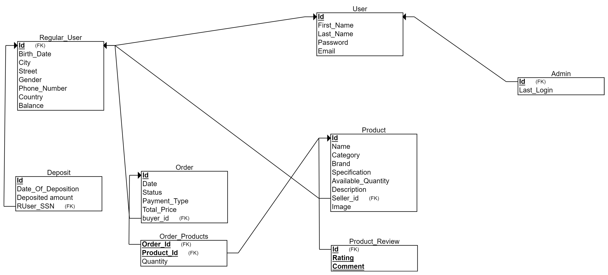

<h2 style="text-decoration:underline">Content</h2>

    <ul>
        <li><a href="#Intro">Introduction</a> 
        <li><a href="#target_bene">Target    Beneficiaries of the Project</a>
        <li> <a href="#adopted_pro">Adopted Programming Language</a>
        <li> <a href="#system_Arch">System Architecture</a>
        <li><a href="#app_level">Application-Level Protocol</a>
        <li> <a href="#dis_database">Distributed Database Design</a>
        <li> <a href="#time_plan">Time Plan</a>
        <li> <a href="#test">Testing</a>
        <li> <a href="#endUser">End-User Guide</a>
        <li> <a href="#ResourcesNeeded">Resources Needed</a>
        <li> <a href="#RoleofEachMember">Role of Each Member</a>
        <li> <a href="#Appendices">Appendices</a>
        <li> <a href="#References">References</a>
    </ul>    

<h2 style="text-decoration:underline" id="Intro">Introduction</h2>

    
Tech Haven is an online tech marketplace where users can purchase and sell a variety of tech products. It offers various online payment options for transactions. The platform's backend is constructed using the Node.js framework.

The System also offers a lot of features:

<ul>
    <li>Create a new account.</li>
    <li>Login to your account.</li>
    <li>It supports different types of users.</li>
    <li>Add/Edit/remove data that is shared between the users.</li>
    <li>Online payment where the user chooses between different payment options, through credit card or e-wallet.</li>
    <li>Multi search options.</li>
    <li>View your account info such as current cash balance, List of purchased items, list of sold items and items to be sold yet.</li>
    <li>Manage inventory of the items.</li>
    <li>Generate different kinds of reports such as reports about the transactions performed on the systems.</li>
    <li>It uses REST APIs to allow frontend to communicate with backend.</li>
    <li>Each user is served on a different thread.</li>
</ul>

Tech Haven is an ecommerce app where tech fans and sellers can meet. Enjoy shopping with modern features. Welcome to Tech Haven, where tech meets convenience!

<h2 style="text-decoration:underline" id="target_bene">Target Beneficiaries of the Project</h2>

   <ol>
    <li>
        <strong>Customers:</strong>
        <ul>
            <li>Customers can benefit from a wide range of products available for purchase, convenient shopping experience, secure payment options, and efficient delivery services.</li>
            <li>They can explore various products, compare prices, read reviews, and make informed purchasing decisions from the comfort of their homes.</li>
            <li>Access to a user-friendly interface with features such as personalized recommendations, wish lists, and order tracking enhances the overall shopping experience.</li>
        </ul>
    </li>
    <li>
        <strong>Sellers:</strong>
        <ul>
            <li>Sellers can leverage the platform to reach a broader audience and expand their customer base.</li>
            <li>They can create storefronts, list their products, manage inventory, and track sales performance.</li>
            <li>Access to analytics and reporting tools enables sellers to gain insights into customer preferences and optimize their marketing strategies.</li>
        </ul>
    </li>
    <li>
        <strong>Delivery Services:</strong>
        <ul>
            <li>Delivery services can benefit from partnerships with the online store to fulfill orders and provide timely and reliable delivery to customers.</li>
            <li>Collaborating with the platform can lead to increased business opportunities and revenue streams for delivery service providers.</li>
        </ul>
    </li>
    <li>
        <strong>Advertisers:</strong>
        <ul>
            <li>Advertisers can utilize the platform's advertising services to promote their products and target specific customer segments.</li>
            <li>Access to a large user base and advanced targeting capabilities allows advertisers to maximize the impact of their marketing campaigns and drive sales.</li>
        </ul>
    </li>
    <li>
        <strong>Economy and Society:</strong>
        <ul>
            <li>The presence of a thriving online marketplace contributes to economic growth by fostering entrepreneurship, creating job opportunities, and driving innovation.</li>
            <li>Consumers benefit from increased competition, which often leads to lower prices and improved product quality.</li>
            <li>The convenience of online shopping helps save time and reduces the environmental footprint associated with traditional retail.</li>
        </ul>
    </li>
</ol>

<h2 style="text-decoration:underline" id= "adopted_pro">Adopted Programming Language</h2>

    
    
    
    
    

<h2 style="text-decoration:underline" id = "system_Arch">System Architecture</h2>

    
We adopted a 3-Tiered Client/Server Model for its distinct advantages in scalability, modularity, and maintainability. In this architecture, the client tier handles user interaction and presentation, the server tier manages application logic and processing, while the database tier stores and retrieves data. This design ensures a clear separation of concerns, facilitating easier development, deployment, and future enhancements. 

    

<h2 style="text-decoration:underline" id = "app_level">Application-Level Protocol</h2>

    ToDo

<h2 style="text-decoration:underline" id="dis_database">Distributed Database Design</h2>

    <h3>EER design: <h3>
    
    <h3>Relational design: <h3>
    

<h2 style="text-decoration:underline" id = "time_plan">Time Plan</h2>

    

<h2 style="text-decoration:underline" id="test">Testing</h2>

    ToDo

<h2 style="text-decoration:underline" id="endUser">End-User Guide</h2>

    

        Fisrt of all go to the website of our store through this link 
        <a href="https://techhaven-mhxn.onrender.com/market?fbclid=IwZXh0bgNhZW0CMTAAAR13aC0_QToAXXUElD4DX2ijCqOo0bLYx25Wipn6zh0q3X6L-O2EQihdAjI_aem_ASqZS8K1odwDqO4KXl9m5w8CRt8K-s_ESPduKrY-JRQ4S5Fx-wtRAgoa4nipImQjtqX-xQdDQA-Kt3zJK8qJYnki">Techhaven</a>
    

    

        If you already have an account on the website, simply log in using your credentials. 
    

    
    <ul>
       <li>If not, please click on the 'Sign Up' button to proceed to the registration page and create a new account.
       </li>
        <li>Please provide your first name, last name, desired account username, and a strong password. Once you've filled in the required information, click the 'Sign Up' button to complete the registration process.
        </li>
    </ul>
    
    <h3 style="text-decoration:underline">After Login</h3>
    Welcome to the main page displaying the available products for purchase.
     
     
    
     
     
    If you're interested in purchasing any item, simply click on the 'Buy' button next to the product.
     
     
    
    click Add to cart
     
     
    
     
    You'll notice that the cart button displays a notification indicating that the item has been added successfully.
     
    Now, to proceed with the payment for your selected product, simply click on the cart button.
     
    
    

        Next, select your preferred payment method: either by Visa or by using your balance on the website.
    

    

        If you choose Visa as your payment method, please provide the required information and then click the 'Pay' button to complete the transaction.
    

    
    

        Congratulations! Your payment for the product has been successfully processed.
    

    

    

        On the sidebar, you'll find buttons for accessing your profile, returning to the home page, adding credit to your account, and logging out.
    

    
    

        if you click the profile page you will find this page
    

    
    

        you will find your balance and you can add products
    

    

        if you click credit button. you will find this page
    

    
    

        you can charge your balance from there by determind the amount of money.
    

     
     
     
    

        if you have any problem. Call us :)
    

<h2 style="text-decoration:underline"id="ResourcesNeeded">Resources Needed</h2>

    <ol>
    <li>
        <strong>Hardware:</strong>
        <ul>
            <li>Servers: To host the website, manage databases, and handle customer transactions.</li>
            <li>Storage Devices: For storing product images, descriptions, and other data.</li>
            <li>Networking Equipment: Routers, switches, and firewalls to ensure reliable internet connectivity and security.</li>
        </ul>
    </li>
    <li>
        <strong>Software:</strong>
        <ul>
            <li>Development Tools: Integrated Development Environments (IDEs) such as Visual Studio Code or IntelliJ IDEA for coding and debugging.</li>
            <li>Version Control Systems: Git for managing code versions and collaboration.</li>
            <li>Operating Systems: Linux or Windows servers to host the website.</li>
            <li>Database Management Systems: MySQL, PostgreSQL, or MongoDB for storing product information and customer data.</li>
        </ul>
    </li>
    <li>
        <strong>Human Resources:</strong>
        <ul>
            <li>Developers: Front-end, back-end, and full-stack developers to build and maintain the website.</li>
            <li>Designers: UX/UI designers to create an intuitive and visually appealing user interface.</li>
            <li>Testers: Quality Assurance (QA) engineers to test the website for bugs and ensure its functionality.</li>
            <li>Project Managers: To oversee the project's progress, allocate resources, and coordinate tasks.</li>
        </ul>
    </li>
    <li>
        <strong>Financial Resources:</strong>
        <ul>
            <li>Budget: Funds for purchasing hardware, software licenses, and hiring personnel.</li>
            <li>Marketing Budget: For advertising the online store, promoting products, and attracting customers.</li>
        </ul>
    </li>
    <li>
        <strong>Time:</strong>
        <ul>
            <li>Adequate time allocation for planning, development, testing, deployment, and ongoing maintenance of the website.</li>
            <li>Timelines and deadlines for completing different stages of the project.</li>
        </ul>
    </li>
</ol>

<h2 style="text-decoration:underline"id="RoleofEachMember">Role of Each Member</h2>

TOOOOOOOOOOOOOODOOOOOOOOOOOOOO
   <table>
    <tr>
        <th>Name</th>
        <th>Role</th>
    </tr>
    <tr>
        <td></td>
        <td></td>
    </tr>
    <tr>
        <td></td>
        <td></td>
    </tr>
    <tr>
        <td></td>
        <td></td>
    </tr>
    <tr>
        <td></td>
        <td></td>
    </tr>
    <tr>
        <td>Abdallah Mohamed</td>
        <td>- Assisted in the Database Design - System Testing</td>
    </tr>
    <tr>
        <td></td>
        <td></td>
    </tr>
    <tr>
        <td></td>
        <td></td>
    </tr>
    <tr>
        <td></td>
        <td></td>
    </tr>
    <tr>
        <td></td>
        <td></td>
    </tr>
    <tr>
        <td></td>
        <td></td>
    </tr>
    <tr>
        <td></td>
        <td></td>
    </tr>
</table>

<h2 style="text-decoration:underline"id="Appendices">Appendices</h2>

    ToDo

<h2 style="text-decoration:underline"id="References">References</h2>

    ToDo

